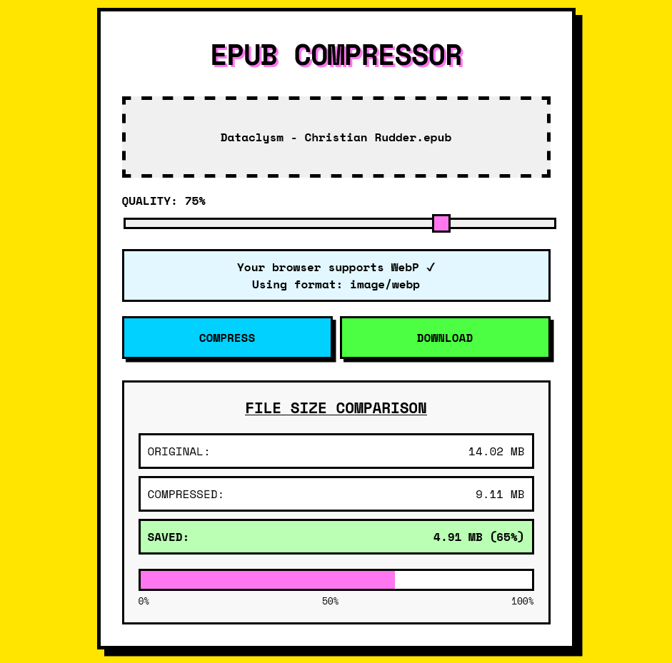

# EPUB Compressor

A browser-based tool for compressing EPUB files by optimizing images while preserving content.

> old python version, support webp and avif
> Source in [main branch](https://github.com/icealtria/epub-compressor/tree/main)
> https://epub-compress.streamlit.app/

## Features

- **Browser-Based Compression**: No need to install any software
- **Drag-and-Drop Interface**: Simple and intuitive file handling
- **Adjustable Quality Settings**: Control the compression level to balance size and quality
- **Format Detection**: Automatically uses WebP for modern browsers, with JPEG fallback
- **Visual Feedback**: Shows compression statistics with progress indicators
- **Privacy-Focused**: All processing happens locally in your browser - no files are uploaded to any server

## How It Works

EPUB Compressor works by:
1. Extracting the EPUB file contents in your browser
2. Identifying and compressing images using modern compression techniques
3. Maintaining the EPUB structure and text content
4. Rebuilding a new, optimized EPUB file for download

## Usage

1. **Drag and drop** an EPUB file onto the interface or click to select a file
2. Adjust the **quality slider** to set your desired compression level
   - Higher values preserve more image quality but result in larger file sizes
   - Lower values reduce file size but may affect image quality
3. Click the **Compress** button to start processing
4. Once compression is complete, view the comparison statistics
5. Click the **Download** button to save your compressed EPUB file

## Browser Compatibility

- Modern browsers (Chrome, Firefox, Edge, Safari)
- WebP format is used when supported for better compression
- JPEG is used as a fallback for browsers without WebP support

## Technical Details

- Built with Svelte and TypeScript
- Uses client-side JavaScript for all processing
- Employs modern browser APIs for file handling and image compression
- Neobrutalist design for a distinctive visual appearance

## License

MIT License - see the LICENSE file for details